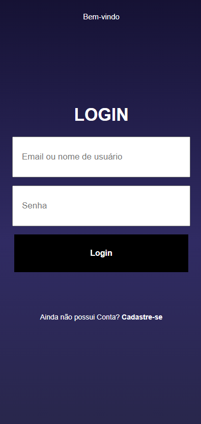
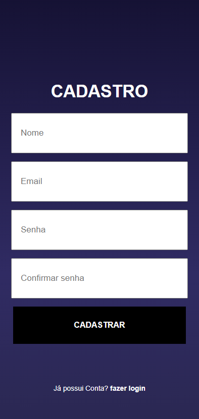
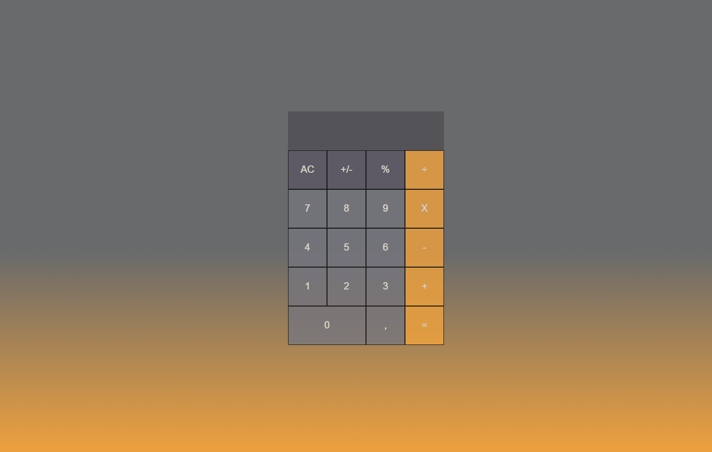
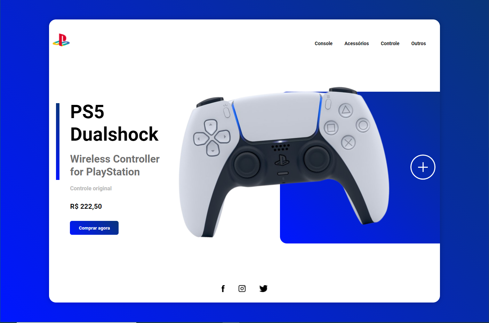
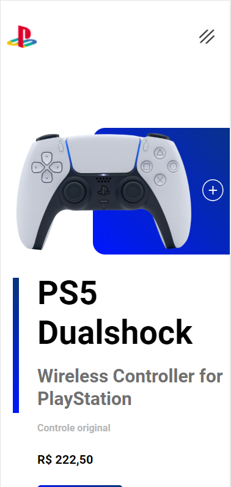
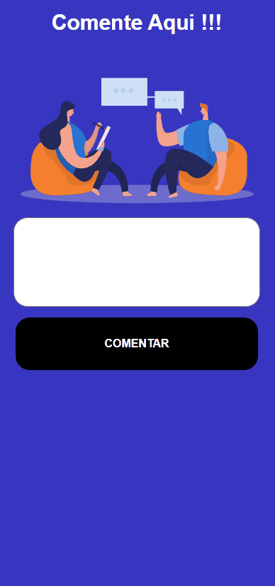
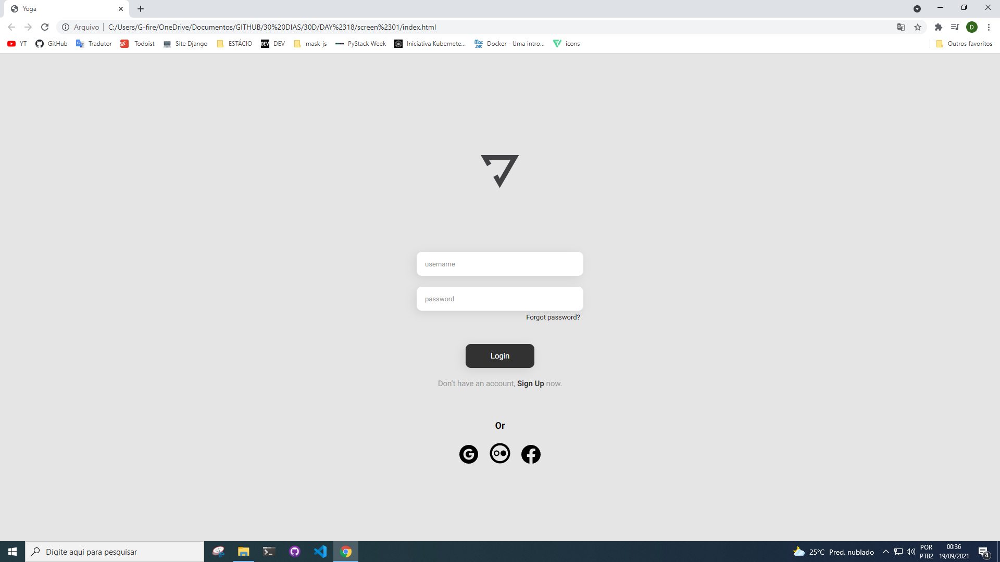
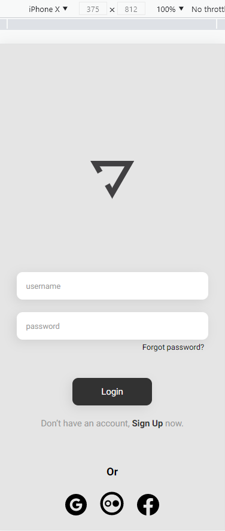
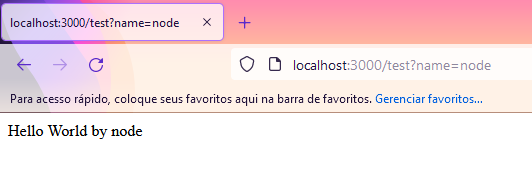

<h1>30D</h1>

30 dias consecutivos de estudo ou projeto. Acesse os códigos na pasta code, confira todos os resultados na pasta results.

 

<h2>Principais projetos</h2>
<ul>

<li>
<h3>Tela de login e cadastro</h3>

</li> 

<li>
<h3>Calculadora</h3>

</li> 

<li>
<h3>Playstation Store, <a href="https://playstation-store-project.netlify.app/">acesse aqui</a></h3>

</li> 

<li>
<h3>App react de comentários</h3>

</li> 

<li>
<h3>Projeto com figma</h3>

</li> 

<li>
<h3>Projeto com Node</h3>

</li> 

</ul>
